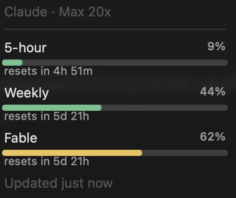

# Token Widget

A tiny macOS menu bar app that shows your **Claude** usage limits at a glance — 5-hour session, weekly, and model quotas — with live progress bars and second-accurate reset timers.

Built for people who live in Claude / Claude Code and don’t want to keep opening the web dashboard.

<p align="center">
  
</p>

<p align="center">
  
</p>

## Features

- **Menu bar strip** — usage bar, percent, and cooldown ring without opening a window
- **Dropdown details** — 5-hour / Weekly / model rows with progress bars
- **Second-accurate countdowns** — timers tick locally from Claude’s reset timestamps
- **Easy sign-in** — imports an existing **Claude Code** login when possible; otherwise browser OAuth with auto code pickup
- **Lightweight** — menu bar only (`LSUIElement`), no Dock icon

## Requirements

- macOS **14** (Sonoma) or later
- A Claude account (Pro / Max / etc. with usage limits)
- Optional but nicest path: [Claude Code](https://claude.ai/code) already signed in on this Mac

## Install

### Option A — Build from source (recommended today)

```bash
# 1. Clone
git clone https://github.com/adityarai7297/token-widget.git
cd token-widget

# 2. Tools
brew install xcodegen
xcode-select --install   # if you don't already have Xcode / CLT

# 3. Build + install into /Applications
./build.sh

# 4. Launch
open "/Applications/Token Widget.app"
```

First launch on a Mac that didn’t sign the build: right-click the app → **Open** → **Open**, or allow it in **System Settings → Privacy & Security**.

### Option B — Prebuilt release

When releases are published on GitHub, download the latest `.zip` / `.dmg` from the [Releases](https://github.com/adityarai7297/token-widget/releases) page, move **Token Widget** to `/Applications`, and open it.

> Tip: keep it in **System Settings → General → Login Items** if you want it at login.

## Sign in

1. Click the menu bar item → **Sign In…** (or let it prompt on first launch).
2. If Claude Code is already logged in, Token Widget usually **imports those credentials** and you’re done.
3. Otherwise a browser window opens for Claude OAuth:
   - Approve access
   - Copy the auth code when shown (**⌘C**)
   - Token Widget detects the clipboard automatically — you don’t paste anywhere
4. The menu bar updates with your live usage.

**Sign out** anytime from the same menu.

## Using it

| Where | What you see |
| --- | --- |
| Menu bar | Claude mark · session usage bar · `%` · cooldown ring · time left |
| Dropdown | Plan header · each limit with bar + `%` · `resets in …` · last updated |
| **Refresh Now** (`⌘R`) | Force a fresh pull from Claude’s usage API |
| Tooltips | Hover the menu bar item for a quick 5-hour summary |

Usage percentages refresh about every **60 seconds** (and when you open the menu if data is stale). Countdown text updates every **second** on your Mac — no need to hammer the API for that.

## Privacy

- Tokens are stored **only on your Mac** at  
  `~/Library/Application Support/TokenWidget/credentials.json` (mode `600`).
- Usage cache / logs live in the same folder.
- Network calls go to **Anthropic / Claude** OAuth + usage endpoints only.
- There is **no** analytics backend and **no** third-party tracking in this app.

Sign out (or delete that folder) to wipe local credentials.

## Build notes (contributors)

```bash
./build.sh
```

What the script does:

1. Runs `xcodegen generate`
2. Builds a **Release** `.app` with `xcodebuild`
3. Codesigns (your identity if set, otherwise ad-hoc)
4. Copies the app to `/Applications/Token Widget.app`

Useful env vars:

```bash
# Your Apple team ID (from developer.apple.com) — optional for local ad-hoc builds
export DEVELOPMENT_TEAM=XXXXXXXXXX

# Prefer a specific signing identity (optional)
export CODE_SIGN_IDENTITY="Apple Development: Your Name (XXXXXXXXXX)"

# Skip installing into /Applications
export SKIP_INSTALL=1
```

Open the generated project in Xcode if you prefer:

```bash
xcodegen generate
open TokenWidget.xcodeproj
```

## Troubleshooting

| Problem | Try this |
| --- | --- |
| App won’t open (“unidentified developer”) | Right-click → **Open**, or allow under Privacy & Security |
| Always “Not signed in” | **Sign In…** again; confirm Claude Code login, or finish browser OAuth + copy the code |
| Rate limited | Wait a bit; avoid spamming **Refresh Now** — Claude’s usage API throttles aggressive clients |
| Bars stuck / old | **Refresh Now**, or quit and reopen the app |
| Want a clean slate | Quit the app, delete `~/Library/Application Support/TokenWidget/`, relaunch |

## Contributing

Issues and PRs are welcome.

1. Fork the repo
2. Create a branch (`feat/…`, `fix/…`)
3. Keep changes focused — UI polish, reliability, and docs help a lot
4. Open a PR describing what & why

Ideas that would help the community:

- Notarized / GitHub Actions release artifacts
- Intel Mac support testing
- Preferences (poll interval, which rows to show, launch at login toggle)
- Better first-run onboarding

## License

[MIT](LICENSE) — free to use, share, and modify.

---

**Not affiliated with Anthropic.** Claude® is a trademark of Anthropic PBC. This is an unofficial community tool.
