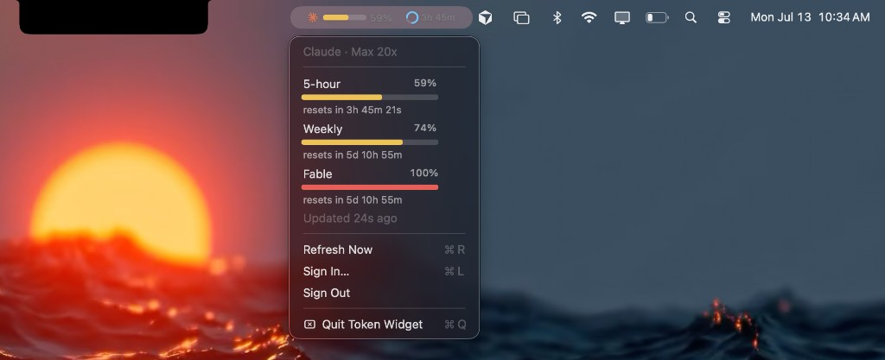

# Token Widget

A tiny macOS menu bar app that shows your **Claude** usage — 5-hour, weekly, and model limits — with live progress bars and reset timers.

<p align="center">
  
  &nbsp;
  
</p>

## Install

1. [Download for Mac (Apple Silicon)](https://github.com/adityarai7297/token-widget/releases/latest/download/Token-Widget-macOS.zip)
2. Unzip and drag **Token Widget** into **Applications**
3. Open it — look for the Claude icon in the menu bar (top-right)

Requires macOS 14+ and a Claude account. Works best if [Claude Code](https://claude.ai/code) is already signed in.

## Sign in

Click the menu bar icon → **Sign In…**

- If Claude Code is logged in, it usually connects automatically
- Otherwise finish the browser login and **copy** the code (⌘C) — the app detects it

## Privacy

- Your Claude tokens stay on your Mac only (`~/Library/Application Support/TokenWidget/`)
- Talks only to Claude / Anthropic — no analytics, no third-party tracking
- **Sign Out** clears local credentials

## Help

| Issue | What to try |
| --- | --- |
| App won’t open | Right-click → **Open**, or allow under **System Settings → Privacy & Security** |
| Not signed in | Use **Sign In…** again and copy the browser code |
| Numbers look old | Click **Refresh Now** |

## Developers

```bash
git clone https://github.com/adityarai7297/token-widget.git
cd token-widget
brew install xcodegen
./build.sh
```

Release / notarization notes: [docs/NOTARIZE.md](docs/NOTARIZE.md)

## License

[MIT](LICENSE)

Not affiliated with Anthropic. Claude® is a trademark of Anthropic PBC.
